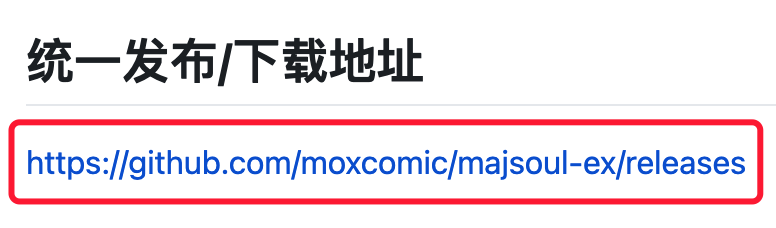
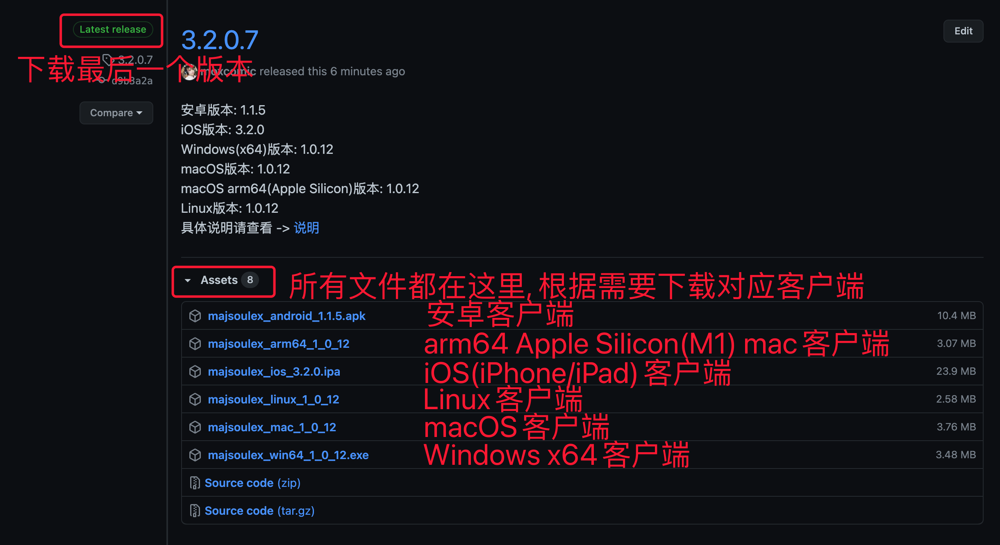
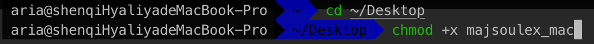
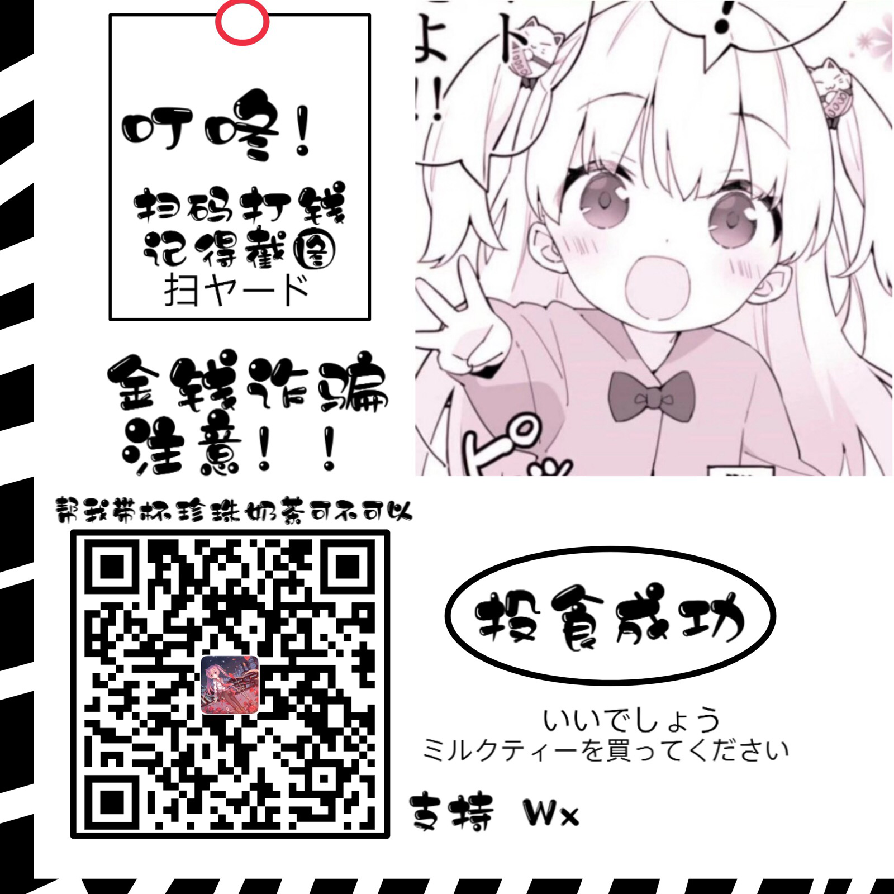
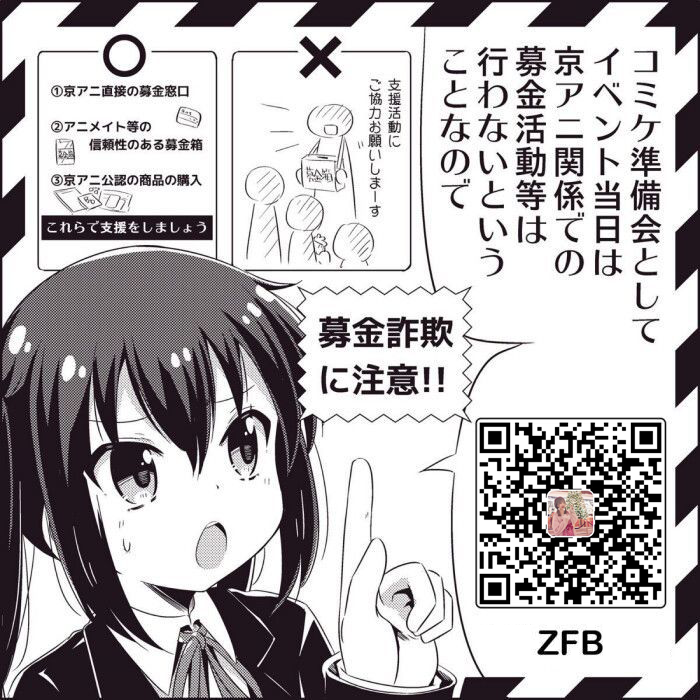
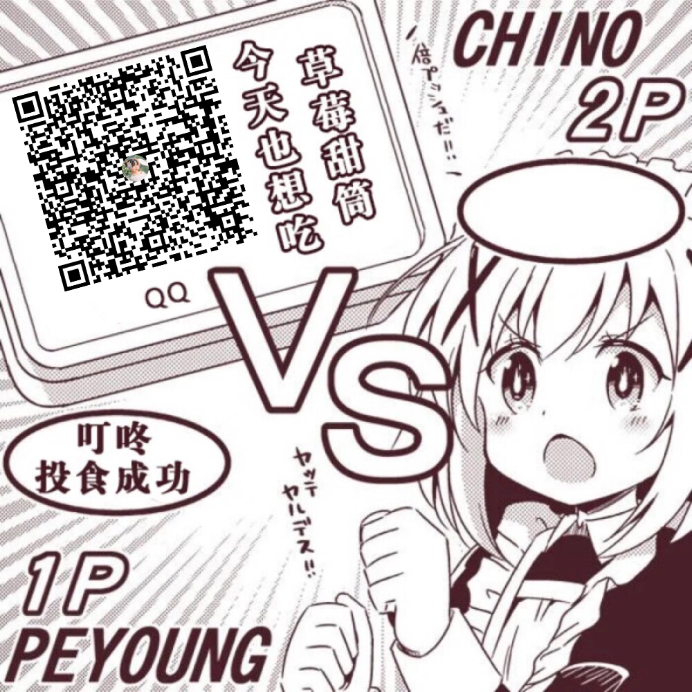

# 雀魂 Ex

雀魂 Ex（Majsoul Ex）是一款基于雀魂网页版进行二次开发的第三方客户端, 目前客户端支持 Windows/macOS/Linux/Android/iOS 五大平台, 由于本项目开发及维护者仅有一人故更新时间并不稳定。

## 统一发布/下载地址

[https://github.com/moxcomic/majsoul-ex/releases](https://github.com/moxcomic/majsoul-ex/releases)

### 下载教程

1. 点击下载点解
   
2. 选择对应的客户端下载
   

### 安装教程

#### Android 安卓客户端

直接下载安装

#### iOS iPhone/iPad 客户端

百度查询签名进行安装

#### Windows

双击运行

#### Linux / macOS

下载后先执行`chmod +x $文件名`赋予运行权限

例如我们这里下载的文件放到了桌面上, 就先执行`cd ~/Desktop`命令(放在哪就 cd 到哪儿), 然后执行`chmod +x $文件名`, 这里我们假设文件名是`majsoulex_mac`这时这条命令完整的就是`chmod +x majsoulex_mac`

#### Apple Silicon (M1)

M1 芯片的 Mac 可能不支持部分指令，所以需要先安装`homebrew`、`upx`然后使用`upx -d $文件名`解压文件后才能运行,具体方案请自行百度

## PC 端使用教程

插件安装: 将插件文件解压到 Extensions 目录下即可  
其他设置参照 config.json

## Mobile 移动端

### Android 安卓

没有特殊说明

### FAQ

Q: 为什么字体显示乱码？  
A: 请手动切换一次语言, 例如当前游戏语言为简体中文就手动切到繁体中文后再切回来.

Q: 为什么更新后没有新活动或者刷新不出资源?  
A: 请手动删除一次 Cache 文件夹, 路径为/Android/data/com.yuuki.majsoulex/files/Cache

Q: 为什么无法加载出源以及首页显示为空？  
A: 因为部署的服务器在海外, 如无法正常访问/下载请使用 VPN

Q: 如何安装插件?
A: 可以通过内置的插件源下载, 或者其他途径下载到的插件点击选择其他应用打开后往下滑找到雀魂 Ex 选择打开即可

### iOS 苹果

由于 iOS 系统特殊限制安装需要签名, 具体办法请自行解决, 如果赞助的多了后会考虑其他方案.

### FAQ

Q: 为什么无法签名?  
A: 开发者测试并没有任何问题可以正常签名, 请检查您的签名方式

Q: 签名提示 Arch 结构错误?  
A: 开发者测试签名正常, 请检查您的签名方式

Q: 如何安装插件?  
A: 由于系统限制原因只能通过内置插件源进行下载

## 联系方式

- B 站 ID: [神崎·H·亚里亚](https://space.bilibili.com/898411/)
- B 站 ID: [关野萝可](https://space.bilibili.com/612462792/)
- QQ 交流群: [991568358](https://jq.qq.com/?_wv=1027&k=3gaKRwqg)

## 赞助

如果对您有所帮助，欢迎您的赞赏

<figure class="third">
    
    
    
</figure>
